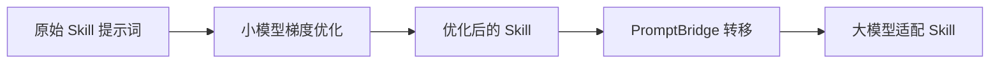
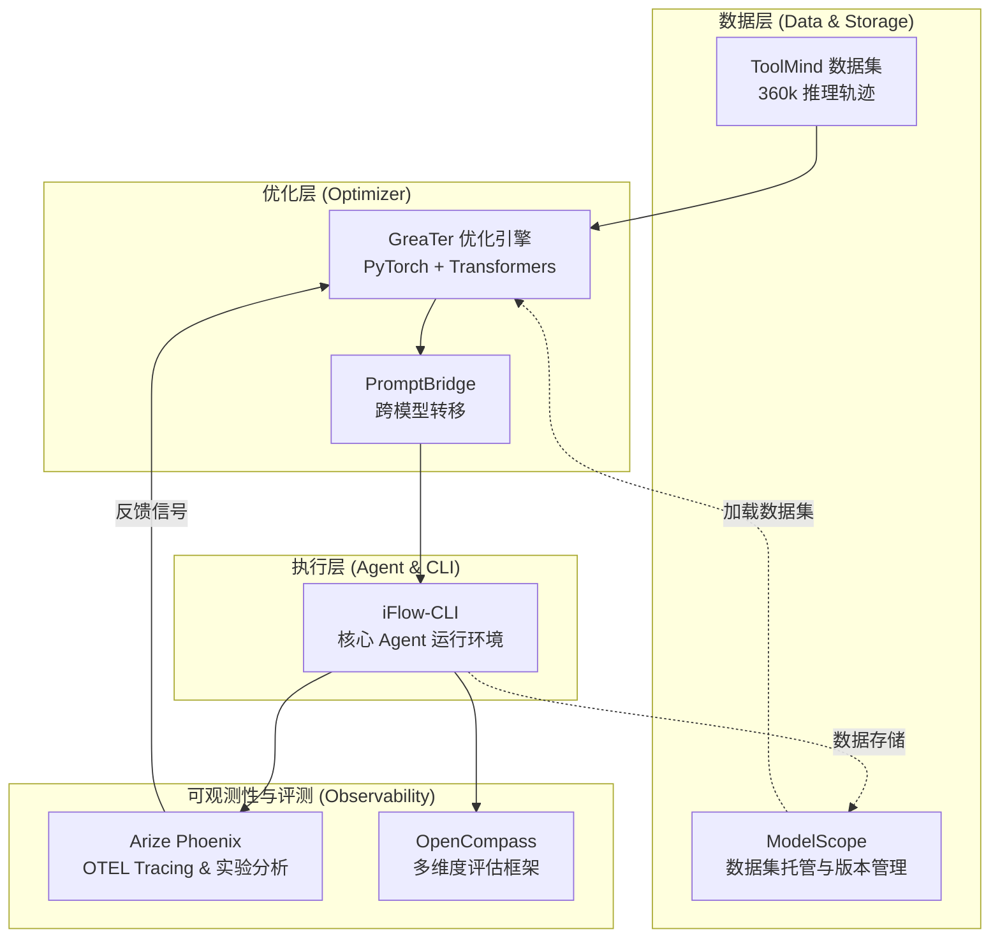

# 项目上下文

## 目的

### 项目名称：Agent Skill 自动优化系统

### 核心目标

构建一个**基于梯度信息的 Agent 技能提示词自动优化系统**，实现以下两阶段优化流程：

### 详细目标

#### 阶段一：小模型梯度优化 (基于 GreaTer)

利用 **GreaTer (Gradient Over Reasoning)** 方法在轻量级开源语言模型上进行 Skill 提示词优化：

- **输入**: Agent 的 Skill 定义文件 (`SKILL.md`)
- **优化目标**: 优化 `SKILL.md` 中的提示词内容
- **处理**: 通过计算推理链上的 token 梯度，迭代优化提示词中的关键 token 选择
- **输出**: 在小模型上性能最优的 Skill 提示词

**核心优势**：
- 无需依赖闭源优化器模型（如 GPT-4）
- 利用梯度信号获得更强的优化指导
- 支持 Llama 3、Gemma 2 等开源小模型

#### 阶段二：跨模型提示词转移 (基于 PromptBridge)

使用 **PromptBridge** 技术将小模型优化得到的 Skill 转移到对应的大模型：

- **输入**: 小模型优化后的 Skill 提示词
- **处理**: 跨模型提示词适配与转移
- **输出**: 适配大模型的高效 Skill 提示词

**核心优势**：
- 降低优化成本（小模型优化 + 转移 vs 直接大模型优化）
- 保持优化效果的可转移性
- 支持多种目标大模型

### 系统架构

### 应用场景

1. **Agent 技能库优化**: 自动优化现有 Agent 的技能定义文件
2. **新技能开发辅助**: 为新开发的技能提供自动调优
3. **跨模型部署**: 同一技能在不同规模模型上的适配

### Skill 定义格式

Agent 的 Skill 定义文件为 `SKILL.md`，包含：
- **YAML Frontmatter**: name, description 元数据
- **Markdown 指令**: 技能描述、关键要求、使用策略、快速开始示例、共享约束

## 技术栈

### 核心框架
- **Python 3.10+**: 主要开发语言
- **PyTorch**: 深度学习框架，用于梯度计算
- **Transformers (HuggingFace)**: 模型加载与推理
- **iFlow-CLI**: 端到端 Agent 运行环境及 Skill 载体，用于优化效果的实战验证

### 参考实现
- **GreaTer**: 基于 `llm-attacks` 的梯度优化实现
- **PromptBridge**: 跨模型提示词转移方案

### 支持模型
- **小模型优化器**: Llama 3.2 (1B/3B), Gemma 2 (2B)
- **目标大模型**: GPT-4, Claude, Llama 3 (70B) 等

### 可观测性与评估
- **Arize Phoenix**: 开源 LLM 可观测性平台，用于追踪、评估和实验管理
  - **Tracing**: 追踪 GreaTer 优化过程与 iFlow Agent 运行轨迹（基于 OpenTelemetry）
  - **Evaluation**: 基于 **ToolMind** 数据集评估 Skill 优化效果，利用 Phoenix 对比 Ground Truth 验证性能提升量。
  - **Dataset Management (ModelScope)**: 将各类垂直领域数据集与 Golden Datasets 托管于 **ModelScope (魔搭)**，进行版本管理。

## 项目约定

### 代码风格
- 遵循 PEP 8 Python 代码规范
- 使用 type hints 进行类型标注
- 文档字符串采用 Google 风格

### 架构模式
- 模块化设计：优化器（GreaTer）、转移器（PromptBridge）、执行器（iFlow）分离
- **实战自适应闭环**：GreaTer 在小模型上生成优化参数 -> 自动部署至 iFlow -> 在真实 CLI 环境中运行任务 -> Phoenix 观测性能反馈
- 配置驱动：使用配置文件管理实验参数及 iFlow 插件配置
- 可扩展性：支持添加新的优化策略和目标模型

### 测试策略
- 单元测试覆盖核心优化逻辑
- **iFlow 平台集成测试**：验证优化后的 `SKILL.md` 在 iFlow-CLI 环境中的加载与执行稳定性
- **基于国产平台的自动化评估**：
  - 利用 **OpenCompass** 的评测机制进行语义级别的倾向性评估
  - **基于任务数据集的闭环测试**：针对 **ToolMind** 提供的涵盖工具调用场景与详细推理轨迹的数据，在 iFlow 环境中进行回放测试与性能标定。
  - 建立自动化实验流水线，对比优化前后 Skill 的性能差异
- **Agent Skill 专用评估指标**：
  - 任务完成率：Skill 指导下目标任务的成功率
  - 约束遵守度：MUST/MUST NOT 规则的遵循情况
  - Token 效率：优化后提示词的 token 使用量
  - 工具调用正确性：API 参数和语法正确性

### Git工作流
- 主分支: `main` (稳定版本)
- 开发分支: `dev` (开发中功能)
- 功能分支: `feature/<name>` (新功能开发)

## 领域上下文

### 提示词优化技术背景

1. **基于文本的优化方法**: 依赖闭源大模型（如 GPT-4）作为优化器，成本高昂
2. **基于梯度的优化方法**: GreaTer 等利用开源小模型的梯度信息，直接优化 token 选择
3. **跨模型转移**: PromptBridge 等方法解决不同模型间提示词效果不一致的问题

### Agent Skill 结构

Agent 技能提示词通常包含：
- **功能描述**: 技能的核心用途
- **关键约束**: MUST/MUST NOT 规则
- **使用策略**: 成本优化、token 优化等指导
- **示例代码**: 快速开始模板
- **详细参考**: 完整 API 和高级用法

## 重要约束

### 技术约束
- 小模型优化需要 GPU 支持（建议 2×GPU 加速）
- GreaTer 当前不支持 KV-cache，优化速度受限
- 需要处理非 ASCII 字符和特殊 token

### 业务约束
- Skill 优化结果需保持语义一致性
- 优化后的提示词应保持可读性
- 跨模型转移需验证效果不退化

## 外部依赖

### 模型服务
- HuggingFace Hub: 开源模型托管与访问
- 可选: OpenAI API / Anthropic API (用于大模型评估)

### 工具与平台
- **iFlow-CLI**: [GitHub Repository](https://github.com/iflow-ai/iflow-cli) - 基于 Skill 驱动的 Agent CLI
- **ModelScope (魔搭)**: 用于数据集托管与版本管理
- **OpenCompass (司南)**: 用于大规模模型评测与性能对齐可视化

### 初始 Skill 数据来源

**生成策略**: 根据数据集的不同任务类型，模仿 [Anthropic 官方 Skills 格式](https://github.com/anthropics/skills) 生成初始 Skill

**参考格式规范**:
- 官方 Skills 仓库: `github.com/anthropics/skills`
- Skills 规范定义: `./spec` 目录

**生成流程**:

1. **分析任务类型**: 根据数据集样本识别任务类别（如搜索、文档处理、代码生成等）
2. **匹配 Skill 模板**: 参考 Anthropic 官方同类 Skill 的结构和风格
3. **生成初始 SKILL.md**: 按照官方格式生成包含 YAML frontmatter + Markdown 指令的初始 Skill
4. **优化迭代**: 使用 GreaTer 对生成的初始 Skill 进行梯度优化

### 评估数据集
- **ToolMind**: 核心评估基准，提供完美的工具调用匹配、详尽的推理链及高质量多轮交互轨迹。
- 基于 Skill 定义构建的任务完成测试集
- 约束遵守度验证测试用例

### 参考论文与代码
- [GreaTer (ICLR 2025)](https://openreview.net/pdf?id=fWRBheSJth): 梯度优化方法
- [PromptBridge](file:///Volumes/TSU302/skillsOptimization/solutionDesign/referenceSolution/PromptBridge-%20Cross-Model%20Prompt%20Transfer%20for%20Large%20Language%20Models.pdf): 跨模型转移方法
- [GreaTer 代码实现](file:///Volumes/TSU302/skillsOptimization/solutionDesign/referenceSolution/GreaTer): 基于 llm-attacks 的实现
