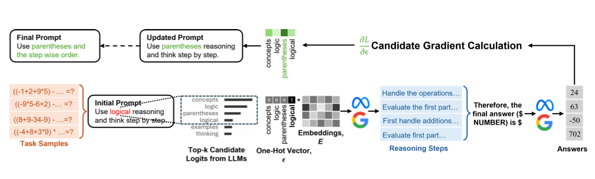
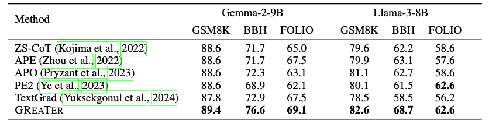
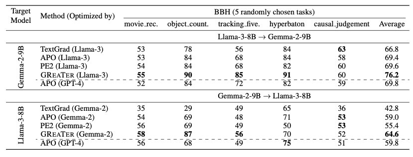

# GReaTer - Gradient Over Reasoning makes Smaller Language Models Strong Prompt Optimizers

Source code for ICLR 2025 paper [GReaTer - Gradient Over Reasoning makes Smaller Language Models Strong Prompt Optimizers](https://openreview.net/pdf?id=fWRBheSJth)

## Overview
In this paper, we propose a new technique of prompt optimization with smaller language models, called GReaTer that leverages gradient information over task-specific reasoning. Compared to text-based prompt optimization methods that usually require closed source optimizer models with strong capabilities, GReaTer allows prompt optimization with lightweight open-source language models by calculating gradients over the reasoning chain



As shown in this figure, GReaTer uses a small amount of task samples to calculate token gradients over the reasoning steps and therefore refine token selections. Consequently, GReaTer leverages a stronger signal to pick the prompt, leading to better prompt optimization even when using lightweight language models.

## Setting Environment
- Install requirements with ```pip install requirements.txt```. You might face some errors due to the mismatch with fschat version. Feel free to ignore them. You may also want to update the transformers to the latest version available.
- Get access from huggingface-hub
```
# only required for model access from huggingface. If you already got it figured out, don't worry about it.
from huggingface_hub import login

# Define your Hugging Face token
hf_token = "YOUR_HUGGING_FACE_TOKEN"  

# Log in to Hugging Face
login(token=hf_token)
```
## Running GReaTer

- Clone the Repository
- Change directory to ```prompt_optimization/experiments/```
- Run ``run_llama3_all.sh`` or ``run_gemma2_mcq.sh`` to optimize prompts for different BBH tasks.
- To separately run gemma2_2b with some specific BBH (e.g. tracking_shuffled_objects_five_objects) task from BBH:

```
python main.py --config="./configs/transfer_gemma2_2b.py" --config.train_data="../data/BBH/tracking_shuffled_objects_five_objects.json" --config.test_data="../data/BBH/tracking_shuffled_objects_five_objects.json" --config.result_prefix="results/transfer_llama32_1b_tracking_shuffled_objects_five_objects.json" --config.progressive_goals=True --config.stop_on_success=False --config.allow_non_ascii=False --config.num_train_models=1 --config.n_train_data=50 --config.n_test_data=50 --config.n_steps=100 --config.test_steps=500 --config.anneal=True --config.topk=11 --config.topq=6 --config.control_init=" proper logical reasoning and think step by step. Finally give the actual correct answer." --config.extractor_text="Therefore, the final answer (use exact format: '\$A' or '\$B' or '\$C' or '\$D' or '\$E') is $" --config.control_weight=0.20 --config.target_weight=1.0
```
- Depending on the task to optimize, you need to change the ```extractor_text``` so that you can extract the correct answer properly, which is fundamental in calculation of the loss. In ``run_llama3_all.sh`` or ``run_gemma2_mcq.sh``, we have provided all the extractor texts required for different BBH tasks. For other tasks you can follow the format to create a similar extractor text. The target is to use an extractor text that will generate the answer in the same format as the ground truth, to facilitate in generating the final correct answer.

- You can change ``top_k`` and ``top_q`` as required, which may impact performance.
- In ``experiments/configs``, configs for ``transfer_llama3`` and ``transfer_gemma2`` exists. The gpus need to be changed to assign which gpu you want to use. Yes we are using two gpus for each run. Realistically we don't even need one full gpu, but this is to slighly do the experiments faster.

## Performance Highlights


From the table, we can observe that GReaTer prompt substantially outperforms other baselines offering notable performance gain. Compared to other baselines, GReaTer prompts shows more consistent performance demonstrating the potency of this prompt optimization approach.


From this table, we see that GReaTer optimized prompts also show good transferability to other language models. Compared to other baselines, GReaTer shows notably improved transferability performance, indicating the potential of using a small language model to optimize the prompt while transferring to a larger one.


## Notes

- This implementation is built on top of [llm attacks](https://github.com/llm-attacks/llm-attacks) codebase. 
- TODO: update by incorporating KV-cache to ensure the whole forward pipeline can be effectively done in one single call, which will make this faster.

## Citation

```
@inproceedings{
das2025greater,
title={{GR}eaTer: Gradients Over Reasoning Makes Smaller Language Models Strong Prompt Optimizers},
author={Sarkar Snigdha Sarathi Das and Ryo Kamoi and Bo Pang and Yusen Zhang and Caiming Xiong and Rui Zhang},
booktitle={The Thirteenth International Conference on Learning Representations},
year={2025},
url={https://openreview.net/forum?id=fWRBheSJth}
}
```
